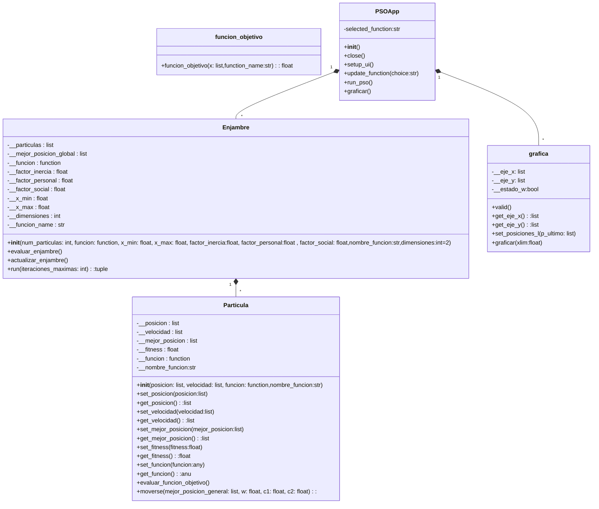

```mermaid
classDiagram
    class Particula {
        -__posicion : list
        -__velocidad : list
        -__mejor_posicion : list
        -__fitness : float
        -__funcion : function
        -__nombre_funcion:str
        +__init__(posicion: list, velocidad: list, funcion: function,nombre_funcion:str)
        +set_posicion(posicion:list)
        +get_posicion():list
        +set_velocidad(velocidad:list)
        +get_velocidad():list
        +set_mejor_posicion(mejor_posicion:list)
        +get_mejor_posicion():list
        +set_fitness(fitness:float)
        +get_fitness():float
        +set_funcion(funcion:any)
        +get_funcion():anu
        +evaluar_funcion_objetivo() 
        +moverse(mejor_posicion_general: list, w: float, c1: float, c2: float) : 
    }

    class Enjambre {
        -__particulas : list
        -__mejor_posicion_global : list
        -__funcion : function
        -__factor_inercia : float
        -__factor_personal : float
        -__factor_social : float
        -__x_min : float
        -__x_max : float
        -__dimensiones : int
        -__funcion_name : str
        +__init__(num_particulas: int, funcion: function, x_min: float, x_max: float, factor_inercia:float, factor_personal:float , factor_social: float,nombre_funcion:str,dimensiones:int=2)
        +evaluar_enjambre()  
        +actualizar_enjambre()  
        +run(iteraciones_maximas: int) :tuple
    }

    class funcion_objetivo {
        +funcion_objetivo(x: list,function_name:str) : float
    }

    class grafica {
        -__eje_x: list 
        -__eje_y: list
        -__estado_w:bool
        +valid()
        +get_eje_x():list
        +get_eje_y():list
        +set_posiciones_l(p_ultimo: list)
        +graficar(xlim:float)
    }
    Enjambre "1"*--"*" Particula
    PSOApp "1"*--"*" Enjambre
    PSOApp "1"*--"*" grafica

    class PSOApp{
        -selected_function:str
        +__init__()
        +close()
        +setup_ui()
        +update_function(choice:str)
        +run_pso()
        +graficar()
    }
```
