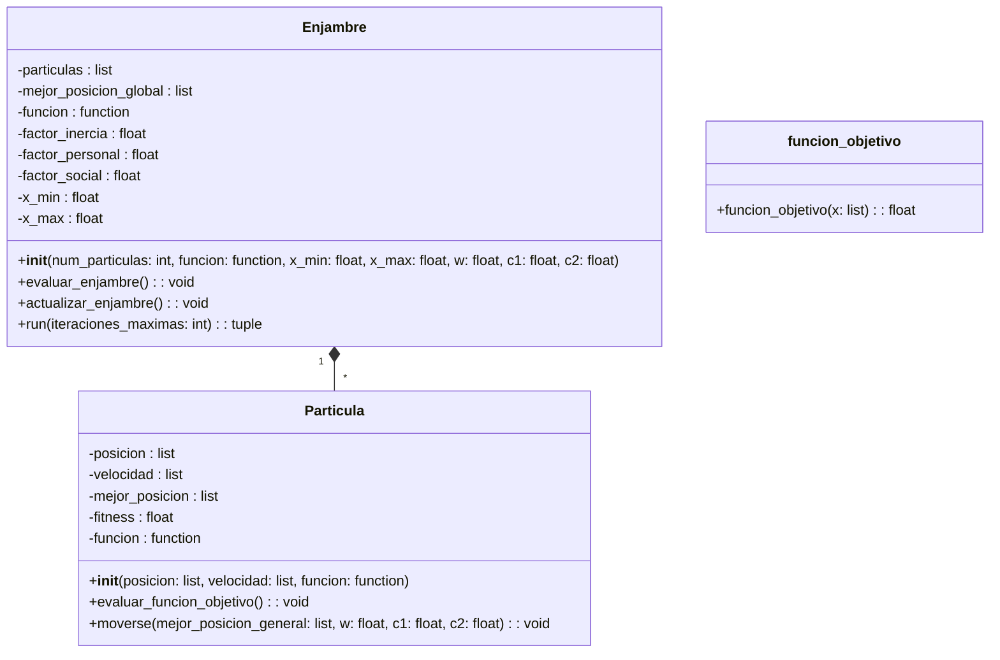

# Proyecto_poo
## Algoritmo PSO(*Particle Swarn Optimization*)
### Explicacion:
La optimización por enjambre de partículas consiste en que cada partícula es una solución potencial al problema de optimización en cuestión; la posición de cada partícula se ajusta de acuerdo a su experiencia y a sus vecinos.

Este método está inspirado en la naturaleza, por ejemplo, el comportamiento que tienen las bandadas de pájaros o bancos de peces en los que,  el movimiento de cada individuo es el resultado de combinar las decisiones individuales de cada una con el comportamiento del resto. 

En pocas palabras los valores de las partículas se actualizan de acuerdo a la mejor posición encontrada en el enjambre, denotada por  “g”.

  

Para actualizar la velocidad de las partículas en el momento “t+1” se calcula de la siguiente manera: 

  

En donde :
 + $\ V_{j}^{(t+1)} \$: La nueva velocidad.
 + $\ V_{j}^{(t)} \$: La velocidad actual.
 + $\ w\$: Reduce o aumenta la velocidad de la partícula.
 + $\ P_1  P_2\$:Son valores aleatoreos en el rango $\ [0,1]\$.
 + $\ I_{j}^{(i)}\$:Mejor posición en la que ha estado la partícula  $\ i\$.
 + $\ X_{j}^{(i)}\$:Posición de la partícula $\ i\$ en el momento $\ t\$.
 + $\ c_1  c_2\$:Constantes de aceleración positivas usadas para escalar la contribución de los componentes cognitivos y sociales.
 + $\ g_j\$:Posición del enjambre en el momento $\ t\$ el mejor valor global.

De esta manera, se crea el siguiente diagrama de clases:

A continuación se muestra un diagrama de flujo como resumen del algoritmo:

  

### Resolución  del problema
Se identificaron 2 conceptos a abstraer los cuales fueron las clases luego denominadas como: **partícula y enjambre**. 

Partícula a  la cual se le dio velocidad, posición y el mejor valor de la misma definido como *fitness*.

En la clase partícula se tienen los métodos evaluar y, mover que evalúan  la función objetivo en la posición actual y actualizan la velocidad y posición de la partícula respectivamente.

Como atributos que varían tenemos los limites  o bordes, la cantidad de iteraciones, la cantidad de partículas y la ecuación que será objetivo , algunos de los cuales se definirán como atributos de la clase enjambre.   

Además de que enjambre distribuye  la cantidad de partículas ingresada uniformemente al inicializarse tiene los métodos *evaluar_enjambre*  ,*actualizar_emjanbre* y *run*.

## Bibliografía :
+ Comparación de algoritmos de optimización con deferentes funciones y dimensiones |PSO-y-ED-López Núñez Ramírez Rodríguez.pdf
## Agregar
+ interfaz
+ grafica en 2 dimensiones
+ maximizar funcion
  

## Requisitos para utilizar el programa de manera local
 + Librería customtkinter v 5.2.2 (para la interfaz de usuario)
